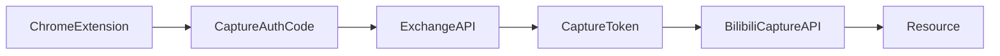

# Capture 鉴权数据模型（长期维护）

本文是 PineSnap「浏览器扩展采集鉴权」的长期真相文档，描述 `CaptureAuthCode`、`CaptureToken` 与 `Resource` 的职责、关系和生命周期。

> 适用范围：`/connect/bilibili/authorize`、`/api/capture/extension/*`、`/api/capture/bilibili`。

## 1. 先回答：`CaptureToken` 还有用吗？

有，而且是**核心运行时凭证**。

- `CaptureAuthCode` 只用于短时握手（一次性 code）。
- 扩展真正调用 `POST /api/capture/bilibili` 时，携带的是 `CaptureToken`（Bearer）。
- 服务端在 `verifyCaptureToken()` 中校验 token 哈希、撤销状态、scope（`capture:bilibili`）。

结论：`CaptureAuthCode` 是“发证过程”，`CaptureToken` 是“持证运行”。

## 2. 表与职责

### 2.1 `CaptureAuthCode`（短时一次性授权码）

- 用途：扩展授权回跳后的 code exchange。
- 关键字段：
  - `codeHash`：授权码哈希（唯一）
  - `codeChallenge` / `state` / `redirectUri`：握手安全参数
  - `expiresAt` / `consumedAt`：短 TTL + 单次消费
- 生命周期：创建 -> 校验 -> 消费 -> 失效

### 2.2 `CaptureToken`（采集调用凭证）

- 用途：扩展调用 capture API 的 Bearer token。
- 关键字段：
  - `tokenHash`：明文 token 的哈希（唯一）
  - `scopes`：权限范围（当前重点是 `capture:bilibili`）
  - `revokedAt` / `lastUsedAt`：撤销与使用审计
- 生命周期：签发 -> 使用 -> 轮换/撤销

### 2.3 `Resource`（采集结果落库）

- 用途：存储采集后的结构化内容。
- 与鉴权关系：通过 token 解析出的 `userId` 决定写入归属。
- `content` 保持原始 payload（`VideoCapturePayloadV1`）语义。

## 3. 表之间的关系

### 3.1 逻辑关系（当前无数据库外键）

本仓库目前对这三张表均使用 `userId` 做逻辑关联，**未显式建立 DB Foreign Key**。

- `CaptureAuthCode.userId` -> 用户（Supabase Auth User ID）
- `CaptureToken.userId` -> 用户
- `Resource.userId` -> 用户

### 3.2 过程关系（业务链路）

- 一个 `CaptureAuthCode` 在成功消费后，产生一个新的 `CaptureToken`（过程上接近 1:1）。
- 一个 `CaptureToken` 可用于多次采集，写入多条 `Resource`（过程上 1:N）。

## 4. 关键代码映射

- 授权码创建/消费：`lib/db/capture-auth-code.ts`
- Token 签发/校验/撤销：`lib/db/capture-token.ts`
- 授权码签发路由：`app/api/capture/extension/authorize/route.ts`
- token 兑换路由：`app/api/capture/extension/exchange/route.ts`
- 采集入库路由：`app/api/capture/bilibili/route.ts`

## 5. 变更时必须同步检查

当你修改以下任一项时，必须同步更新本文：

1. `CaptureAuthCode` / `CaptureToken` / `Resource` 的字段或语义
2. `authorize` / `exchange` / `bilibili capture` 任一路由契约
3. token 轮换策略（`label`、`scope`、撤销逻辑）
4. CORS 与扩展来源限制策略

## 6. 维护建议

- 每次发布前人工确认：
  - 扩展连接（authorize -> exchange）成功率
  - 401/403 是否能正确触发重连引导
  - `lastUsedAt` 是否更新，`revokedAt` 是否生效
- 若未来引入多设备、多浏览器或组织级权限，优先在本文先补“关系模型”再改代码。

