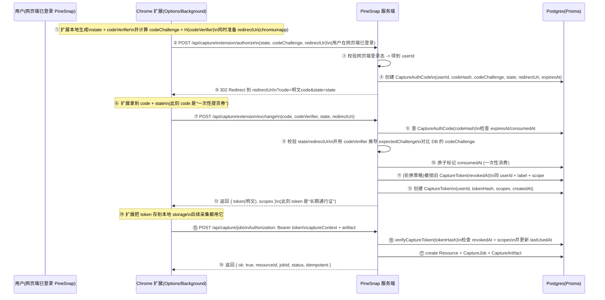

# Capture 鉴权机制概览（Extension ↔ PineSnap）

本文面向项目内开发者，说明 PineSnap 的「浏览器扩展采集」鉴权机制：核心名词、数据模型、端到端时序、API 契约与常见排障路径。

> 适用范围：`/api/capture/extension/*`（authorize / exchange）与 `POST /api/capture/jobs`。  
> 长期真相文档（数据模型语义）：`docs/capture-auth-data-model.md`。

---

## 目标与非目标

### 目标

- **把“网页端已登录用户”安全地关联到“扩展端采集调用”**，并让扩展拿到可用的 Bearer token。
- Token 能被服务端撤销/轮换，且能按 scope 控制权限。
- 服务端只保存 **code/token 的哈希**，避免明文泄漏导致长期风险。

### 非目标

- 不讨论具体字幕抓取与 payload 结构（这属于采集 extractor 与 `CaptureArtifact.content` 契约）。
- 不把网页端 session/cookie 直接下发给扩展（扩展仅使用 capture token）。

---

## 名词解释（先把概念对齐）

### `CaptureAuthCode` / `code`（一次性授权码）

- **用途**：扩展完成“连接 PineSnap”时的短时握手凭证（一次性）。
- **特点**：
  - **短 TTL**（默认 300 秒）
  - **只能消费一次**（`consumedAt` 标记）
  - 仅用于兑换 token（`exchange`），不会用于采集调用
- **为什么需要它**：扩展需要一个能“绑定到当前网页端用户”的凭据，但又不能把网页端登录态直接交给扩展，于是用一次性 code 做安全中转。

### `CaptureToken` / `token`（可重复使用的 Bearer token）

- **用途**：扩展调用采集 API（默认 `POST /api/capture/jobs`）时携带的运行时凭证。
- **特点**：
  - 可撤销（`revokedAt`）
  - 可审计（`lastUsedAt`）
  - 有权限范围（`scopes`，例如 `capture:bilibili`）

### PKCE（`codeVerifier` / `codeChallenge`）

本机制借鉴 OAuth PKCE：

- **`codeVerifier`**：扩展本地生成的随机字符串（“秘密”），只在 `exchange` 时发送给服务端。
- **`codeChallenge`**：由 `codeVerifier` 推导出来（“公开承诺”），在 `authorize` 时发送给服务端并随 `CaptureAuthCode` 保存。
- **服务端校验**：`exchange` 时用 `codeVerifier` 计算 expected challenge，与 DB 里的 `codeChallenge` 做常量时间比较，不匹配则拒绝兑换。

### `state`

- 扩展生成的随机串，用于防 CSRF/重放。
- 服务端在 `authorize` 保存并在 `exchange` 校验一致，否则返回 `invalid_request`。

### `redirectUri`（chromiumapp 回调）

- 扩展发起连接时提供的回调地址：`https://<extension-id>.chromiumapp.org/...`
- 服务端在 `authorize` 保存，并要求 `exchange` 时一致，防止 code 被拿去“换到别的回调”。

---

## 数据库存储（只存哈希）

### `CaptureAuthCode`

字段要点：

- `codeHash`：**明文 code 的 sha256**（唯一），服务端仅存哈希
- `codeChallenge`、`state`、`redirectUri`：握手安全参数
- `expiresAt`：短 TTL
- `consumedAt`：一次性消费标记

### `CaptureToken`

字段要点：

- `tokenHash`：**明文 token 的 sha256**（唯一），服务端仅存哈希
- `scopes`：权限范围（数组）
- `revokedAt`：撤销标记
- `lastUsedAt`：成功鉴权后的最近使用时间（审计/排障）
- `label`：发证来源标签。新版扩展使用 “PineSnap Capture 扩展”，历史 token 仍带有 “Bilibili 扩展”。撤销 / 列举时按 label 集合判断

> 备注：扩展端需要保存 **明文 token**（在本地 storage），服务端永远不需要明文 token。

---

## 端到端时序（什么时候发生什么）

下面的流程把“谁生成什么、何时保存什么、何时校验什么”串起来。

---

## API 契约（面向后端/扩展联调）

### 1) `POST /api/capture/extension/authorize`

**用途**：网页端（用户已登录）发起授权，服务端创建 `CaptureAuthCode`，并 302 回跳扩展回调。

**请求体（JSON 或 form）**：

- `state: string`
- `codeChallenge: string`
- `redirectUri: string`（必须匹配 `https://<32位>.chromiumapp.org/`）

**响应**：

- 未登录：`401 { error: "Unauthorized" }`
- 参数错误：`400 { error: "Invalid request body", details: ... }`
- 成功：`302 Redirect` 到 `redirectUri?code=<code>&state=<state>`

**服务端行为要点**：

- `code` 明文仅存在于回跳 URL；DB 仅保存 `codeHash`。

### 2) `POST /api/capture/extension/exchange`

**用途**：扩展用一次性 `code` 兑换 `token`（并完成 PKCE/state/redirectUri 校验）。

**请求体（JSON）**：

- `code: string`
- `codeVerifier: string`
- `state: string`
- `redirectUri: string`（chromiumapp 回调 URL）

**响应**：

- JSON 解析失败：`400 { error: "Invalid JSON body" }`
- 参数错误：`400 { error: "Invalid request body", details: ... }`
- `invalid_request`：`400 { error: "invalid_request", errorDescription: ... }`（state 或 redirectUri 不一致）
- `invalid_grant`：`401 { error: "invalid_grant", errorDescription: ... }`（code 过期/已消费/verifier 不匹配等）
- 成功：`200 { ok: true, token: string, tokenId: string, scopes: string[] }`

**轮换策略**（当前实现）：

- 对同一个 `userId`、同一个 `label`、并包含 `capture:bilibili` scope 的旧 token 做撤销，再签发新 token。
- 这使得“同一扩展来源”的 token 可以保持单活跃，减少泄漏面（但也意味着重连会让旧 token 立即失效）。

### 3) `POST /api/capture/jobs`

**用途**：扩展上传采集结果（payload），服务端鉴权后写入 `Resource`。

**鉴权**：

- Header：`Authorization: Bearer <token>`
- Required scope：`capture:bilibili`

**响应**：

- 缺少/无效 token：`401 { error: "Unauthorized" }`
- scope 不足：`403 { error: "Forbidden" }`
- 请求体不合法：`400 { error: "Invalid request body", details: ... }`
- 成功：`200 { ok: true, resourceId: string, jobId: string, status: string, idempotent: boolean }`

---

## 常见错误与排障（按“时序”定位）

### A. 授权阶段（authorize）

- **401 Unauthorized**
  - 说明：网页端没有登录 PineSnap（或 cookie/session 无法被服务端识别）
  - 排查：先在网页端正常登录，再走连接流程

- **400 Invalid request body（redirectUri 校验失败）**
  - 说明：`redirectUri` 不是 chromiumapp 回调 URL（或格式不符）
  - 排查：扩展必须使用 `https://<extension-id>.chromiumapp.org/...` 风格回调

### B. 兑换阶段（exchange）

- **400 `invalid_request`**
  - 说明：`state` 或 `redirectUri` 与 authorize 时记录的不一致
  - 排查：确保扩展把同一个 `state/redirectUri` 贯穿 authorize → 回跳 → exchange

- **401 `invalid_grant`**
  - 常见原因：
    - code 过期（超过 TTL）
    - code 已被消费（重复 exchange）
    - `codeVerifier` 与 `codeChallenge` 不匹配（PKCE 不通过）
  - 排查：确保扩展不会重复提交同一个 code；确保 `codeVerifier` 是一开始生成的那个

### C. 采集调用（bilibili capture）

- **401 Unauthorized**
  - 原因：
    - 扩展没带 `Authorization: Bearer ...`
    - token 被撤销/轮换（例如重新连接后旧 token 失效）
  - 排查：确认扩展本地存储 token；必要时重新连接 PineSnap 重新换取 token

- **403 Forbidden**
  - 原因：token scopes 不包含 `capture:bilibili`
  - 排查：确认 exchange 返回的 `scopes`，以及服务端 requiredScope 未被改动

---

## 环境变量与部署注意事项（与扩展强相关）

### `CAPTURE_CORS_ALLOWED_ORIGINS`

扩展 Service Worker 向 PineSnap 发请求时会带：

- `Origin: chrome-extension://<extension-id>`

服务端只有在 allowlist 内的 Origin 才会返回 `Access-Control-Allow-Origin` 等 CORS 头，否则扩展侧会看到 CORS 失败（与 token 是否正确无关）。

- **配置方式**：逗号分隔多个 Origin
- **典型值**：`chrome-extension://<你的扩展ID>`
- **本地联调**：开发者模式“加载已解压的扩展”时，扩展 ID 可能变化；每次变化都要同步更新 allowlist

---

## 安全要点（为什么这样设计）

- **服务端不存明文**：`codeHash` / `tokenHash` 只存 sha256，DB 泄露时不会直接暴露可用 token（仍需配合撤销与轮换策略）。
- **一次性 code + TTL**：缩小授权码被截获后的可用窗口。
- **PKCE**：避免“拿到 code 的第三方”在不知道 `codeVerifier` 的情况下兑换出 token。
- **state/redirectUri 校验**：避免 code 被重放或被换到别的回调绑定。
- **scope**：细粒度授权（当前最小集为 `capture:bilibili`）。
- **轮换策略（按 label+scope）**：同来源 token 保持单活跃，降低长期暴露面。

---

## 关键代码映射（读代码时从这里开始）

- `CaptureAuthCode` 创建/消费：`lib/db/capture-auth-code.ts`
- `CaptureToken` 签发/校验/撤销：`lib/db/capture-token.ts`
- 授权码签发路由：`app/api/capture/extension/authorize/route.ts`
- token 兑换路由：`app/api/capture/extension/exchange/route.ts`
- 采集入库路由：`app/api/capture/jobs/route.ts`
- 长期真相文档（数据模型语义）：`docs/capture-auth-data-model.md`
- 扩展联调/发布前验证：`docs/chrome-extension-bilibili-capture.md`

