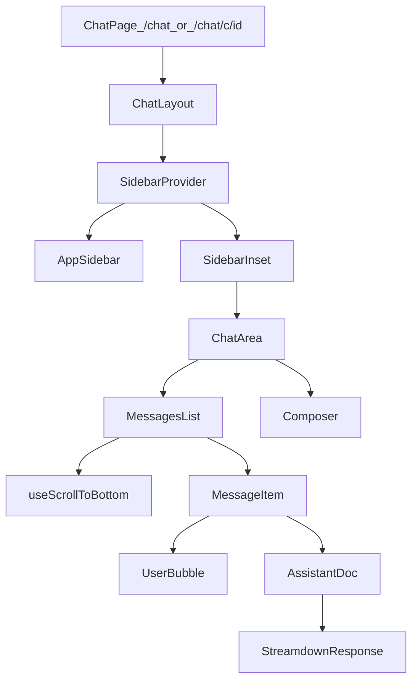

# Design: adopt-ai-chatbot-ui

## 设计原则
- **直接替换，不做兼容层**：减少双实现带来的长期复杂度。
- **UI 参考以 ai-chatbot 为准**：在可控范围内优先复用其组件结构与交互细节。
- **类型安全优先**：不使用 `any`（包含 `as any`），通过明确类型与类型守卫收敛。
- **不触达契约门禁**：不修改路由/API/DB/权限/存储契约，仅调整 UI 侧实现与依赖。
- **允许复用参考代码，但禁止冗余**：可直接迁移/拷贝参考实现的核心组件与 hooks，但 MUST 保持单一实现路径，删除旧代码与死分支。

## 关键决策清单（Decisions）
- **Sidebar**：整套迁移 `SidebarProvider/Sidebar/SidebarInset` 体系；保留现有会话列表数据源（SWR）；不实现 DeleteAll。
- **消息滚动策略**：采用 MutationObserver + ResizeObserver 捕捉内容变化；仅在用户处于底部且非主动滚动时 instant 跟随。
- **消息样式**：
  - User：右对齐蓝色气泡；不显示用户头像。
  - Assistant：左侧小圆图标作为身份标识；正文透明文档流；不使用气泡容器。
- **消息操作**：仅提供 Copy。
- **Markdown 渲染**：使用 Streamdown 替换 ReactMarkdown。

## 组件与数据流（高层）

说明：本变更不改变消息数据结构来源（仍以 `useChat` 输出的 messages/parts 为真相源），仅改变渲染与布局。

## 风险与应对
- **UI 组件依赖链迁移成本**：Sidebar 体系依赖 Sheet/Tooltip/Separator/Input/Skeleton 等组件。策略：优先复用现有 `components/ui/*`，缺失再补齐；保持 API 与样式类结构一致，避免后续维护分叉。
- **RightPanel 布局冲突**：你项目当前是三栏布局；ai-chatbot 是 Sidebar + 主区域。策略：先完成 Sidebar 体系接入并保持 RightPanel；必要时在 `SidebarInset` 内再做二列布局。
- **渲染性能**：Streamdown 与滚动观察器会改变渲染时序。策略：严格遵守“用户滚动优先”原则，避免抢滚动；保持观察范围最小化。

## 不变项（Invariant）
- 不新增/修改页面路由
- 不修改 API 请求/响应形状
- 不修改 DB schema 或落库逻辑
- 不引入权限逻辑变更

